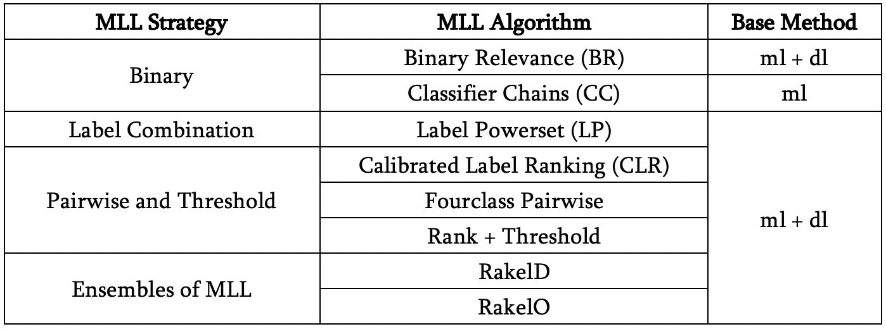
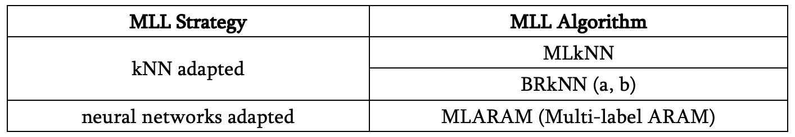
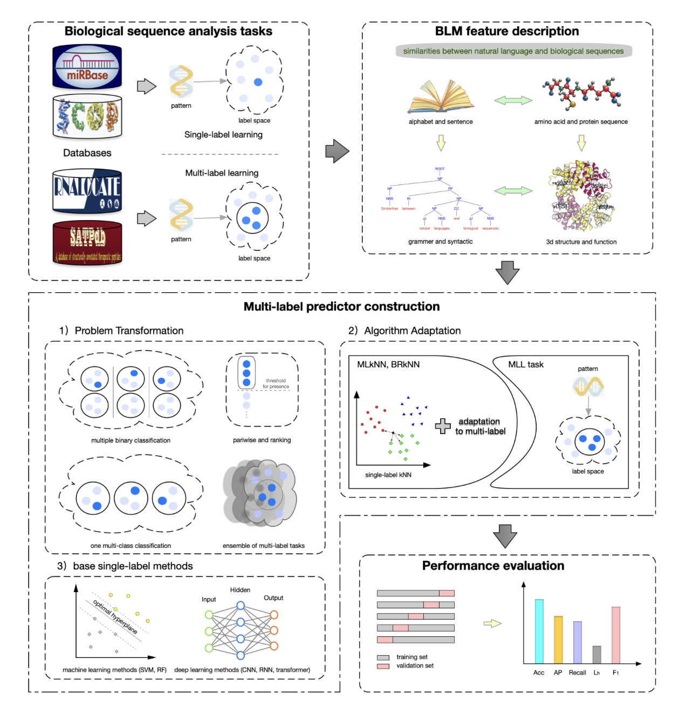

# Tutorial

## Introduction

With the rapid development of biological sequencing, Genome and Protein sequences are growing rapidly but their structure and function and are still unknown. 

Compared with traditional lab-based methods, bioinformatics plays an important role in exploring the relationship buried in the huge amount of biological sequences in various databases. 

Many statistical approaches of pattern recognition and deep learning technologies have been applied in the field of bioinformatics achieving great success. However many of them are restricted by the classical *only-one-label-per-pattern* supervised learning paradigm (also known as *single-label learning*, SLL) and fail to satisfy that requires multiple outputs against a pattern (aka *multi-label learning*, MLL).  

It’s worth noting that many biological tasks comply MLL paradigm such as gene function prediction, protein function prediction, proteins 3D structure prediction and protein subcellular multilocation prediction (proteins may simultaneously exist at, or move between, two or more different subcellular locations).

Despite many works have promoted this very important field in bioinformatics, they still suffer from some problems such as the ignorance of relationships between labels and the limited performance. Moreover, they customized a complicated MLL resolving flow for a specific task without a generalization idea which is easier and more beneficial.

In this work, we propose a lightweight multi-label learning framework to help researchers quickly find candidates of MLL problem transformation strategy combined with base SLL classifiers to apply to their specific biological MLL problems.

To make study of MLL in bioinformatics easily and efficiently, we develop a system called blm-mll to implement the MLL framework which also provide a automatic flow including representation, modeling, training, test and evaluation.

The experiments on seven datasets have proved that the system achieves highly comparable or even superior results than that  of existing state-of-the-art works, which means our system is a powerful tool capable of improving performance or serving as benchmark for extensive MLL applications in bioinformatics. 

Instead of complicated customization workflow for a specific MLL problem, we raise a general framework and provide systematic approaches for studying both sequence-level and residue-level MLL problems in bioinformatics from different strategies. This means our system can be applied in many different MLL tasks in bioinformatics and inspire more powerful customized methods, which is expected to give a widespread influence on this very important field.

It is worth noting that the data representation module in our system meaning are supported by BioSeq-BLM which constructs a BLM against biological sequences while gets restricted in SLL paradigm due to the complicated modeling and training methods of MLL paradigm. From this point of view, our automatic system extending the BLM into an MLL flow is of great significance for better application of the BLM in bioinformatics, bringing new technologies and powerful reference for the MLL study in bioinformatics.

navigation of chapters

For the working flow of system, please refer to Architecture and Pipeline

For the manual of the system, please refer to Command line tools

For the access of the stand-alone package of the system, please refer to Installation Download

Additional Information (how to cite), please refer to /

(algorithm-architecture)=

## Algorithm Architecture

We propose a general MLL strategy framework, which can deal with both sequence-level and residue-level MLL analysis problem. Both of two level problem share the same MLL algorithm architecture, which can be categorized into two groups, i.e. Problem Transformation and Algorithm Adaptation. The implementation of this MLL algorithm architecture are listed in [table a)](#tableA) and [table b)](#tableB). The technique taken by residue-level construction is introduced in [Residue-level vs Sequence-level](#Residue-level-vs-Sequence-level). 

(problem-transformation)=

### Problem Transformation methods

This strategy transforms MLL problem into other well-established learning scenarios. There are 4 MLL strategies in our architecture as shown in [table a)](#tableA) and we give a brief introduction in the following:

- *Binary* strategy transforms multi-label problem to multiple binary-class problems against label space each of which are solved by an individual binary classifier. Binary Relevance (BR) decomposes multi-label problem into multiple independent binary-class problems. While Classifier Chains (CC) decomposes multi-label problem into a *chain* of binary-class problems according to the *Bayesian chain rule*.
- *Label Combination* strategy transforms multi-label problem to a multi-class problem where each label combination is a separate class and uses a multi-class classifier to solve the problem.
- *Pairwise and Threshold* strategy transforms the multi-label problem into a *label ranking* problem, where ranking among labels is fulfilled by techniques of pairwise comparison.
- *Ensembles of MLL* strategy partitions label space and trains a Label Powerset(LP) classifier per partition with a base multi-class classifier. The label sets partitioned may be disjoint(RakelD) or non-overlapping(RakelO).

(tableA)=

table a) 

- `ml` means Machine Learning methods supported in our system including SVM(Support Vector Machine), RF(Random Forest).

- `dl` means Deep Learning methods supported in our system including CNN, LSTM, GRU, Transformer, Weighted-transformer.

(algorithm-adaptation-methods)=

### Algorithm Adaptation methods

This strategy tackle multi-label learning problem by adapting popular learning techniques to deal with multi-label data directly. Here we give four light-weighted and efficient algorithms:

- MLkNN uses k-NearestNeighbors find nearest examples to a test class and uses Bayesian inference to select assigned labels.
- BRkNNaClassifier, BRkNNbClassifier are Binary Relevance multi-label classifier based on k-Nearest Neighbors methods which assign the labels that are assigned to at least half of the neighbors.
- MLARAM is an ART classifier which uses clustering of learned prototypes into large clusters improve performance.

(tableB)=

table b)

(Residue-level-vs-Sequence-level)=

### Residue-level vs Sequence-level

There are two main important tasks in biological sequence analysis, including residue-level analysis and sequence-level analysis. The aim of the residue-level analysis task is to study the properties of the residues while the aim of the sequence-level analysis task is to investigate the structure and function characteristics of the entire sequence. 

Given that the learning paradigm of sequence-level problems fits our MLL strategy framework well and residue-level problem can be decomposed into multiple sequence-level problems, we apply a sliding window strategy following[] in our system extending our MLL strategy framework to both residue-level and sequence-level problems.

## Automatic System

In this work we not only implement the Algorithm Architecture introduced above, but also embed it into an automatic system which requires only raw multi-label resource as input and give standard multi-label prediction as output. The overview flowchart of our system is shown in [Figure 1](#figure1). Given the raw biological data with multi-labels for a general biological multi-label learning task, our system will automatically extract features by a BLM feature descriptor, construct multi-label predictors in case of the strategy specified, fit data, perform prediction and evaluate the performance.

A manual is also supplied to help users configure representation learning, multi-label strategy, base predictor construction and evaluation strategy etc. by command line tools. For more details, please refer to [command line tools](https://blm-mll.readthedocs.io/en/latest/CommandLineTools.html).

(figure1)=

Figure 1.

### BLM feature description

(relation with BioSeq-BLM)

(feature extraction)

### Multi-label predictor construction

(machine learning, deep learning, data representation, ensembles …)

(some tech details)

### Performance evaluation

(which, what, why)
