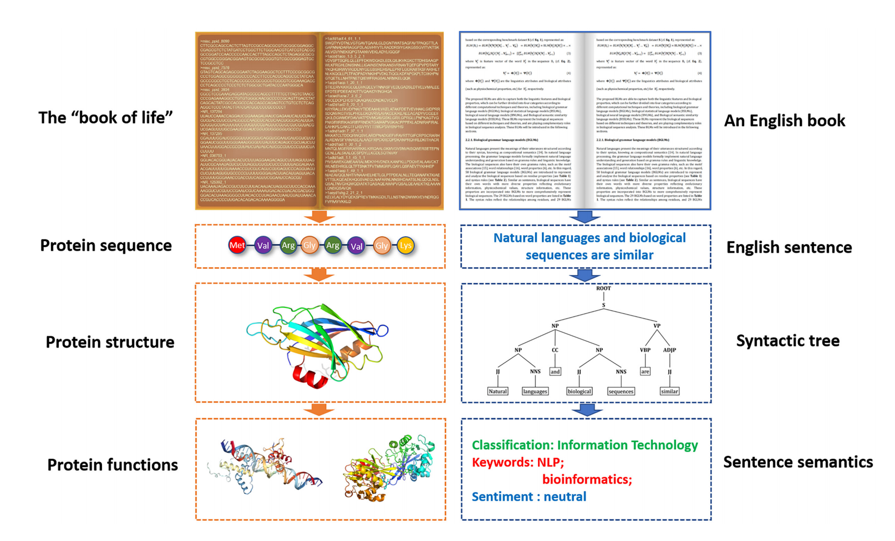

Tutorial
========

Introduction
------------

（概括介绍本项目，从 blm 说起

In order to uncover the meanings of “book of life”, 155 different
biological language models (BLMs) for DNA, RNA and protein sequence
analysis are introduced and discussed in `our previous study <>`__ ,
which are able to extract the linguistic properties of “book of life”.
We extend the BLMs into a system called BioSeq-BLM for automatically
representing and analyzing the sequence.

（research niche

Dispite the powerful analyiing capability for biological sequences, BLM
fails dealing with multi-label learning problems for its one lablel
learning assumption.

（介绍本系统

In this study, we upgrade system BioSeq-BLM to system
BioSeq-BLM-Mll（名字保留修改） which utilizes multiple multi-label
learning strategies and methods providied by BLM to deal with biological
multi-label learning tasks.

（从贡献上，说本系统和BLM的变化

Without changing the shared blcoks in BioSeq-BLM like BLMs construction
and feature analysis, BLM-Mll brings a powerful multi-label learning
module into BLM system which gives a one-stop process for multi-label
learning researchers . Futhurmore, BLM-Mll can use nearly all
single-label learning predictors in BLMs to serve as base-methods of a
multi-label learning algorithm.

（介绍tutorial的结构，分几部分，每部分主要说什么

This tutorial can be split into x parts

part 1 give you an intro to multi-label learning task in bioinfo

part 2 will tell you how BLM-MLL tackle multi-label learning task

part 3 help you learn how to deal with your multi-label learning task by
BLM-MLL

multi-label learning tasks
--------------------------

（一般性定义，研究的意义

Multi-label learning (MLL) is a supervised learning paradigm where each
real-world entity is associated with a set of labels simultaneously.
During the past decade, signifificant amount of progresses have been
made towards this recent learning paradigm for its potention in
improving performance of problems where a pattern may have more than one
associated class.

（Formal Definition

According to Reference [x], we give the formal definition of multi-label
learning framework. Suppose :math:`\mathcal{X} = {\R}^d` denotes the
*d*-dimensional instance space, and
:math:`\mathcal{Y} = \{ y_1, y_2, \cdots , y_q\}` denotes the label
space with q possible class labels. The task of multilabel learning is
to learn a function :math:`h : \mathcal{X} → 2^{\mathcal{Y}}` from the
multi-label training set
:math:`\mathcal{D} = \{(x_i , Y_i)\ |\  1 ≤ i ≤ m\}`. For each
multi-label example :math:`(x_i , Y_i)`, :math:`x_i ∈ \mathcal{X}` is a
d-dimensional feature vector :math:`(x_{i1}, x_{i2}, · · · , x_{id})^⊤`
and :math:`Y_i ⊆ \mathcal{Y}` is the set of labels associated with
:math:`x_i`. For any unseen instance :math:`x ∈ \mathcal{X}` , the
multi-label classifier :math:`h(·)` predicts :math:`h(x) ⊆ \mathcal{Y}`
as the set of proper labels for :math:`x`.

（缩小到生物学中，提出面临的挑战，

In bio-informatics domain, there are many important multi-label learning
tasks for biological analysis , such as RNA-associated subcellular
localizations, protein subcellular localization, … , etc.

In this study, we divide multi-label learning tasks of bio-informatics
domain into two class:

-  Sequenece-level multi-label learning tasks

   (研究任务的范式

   A biological sequence of length :math:`L` can be represented as
   :math:`S=R_1R_2,\cdots,R_n`, where :math:`R_i` is the :math:`i`-th
   Residue in sequence S. In sequenece-level multi-label learning tasks,
   the whole sequence :math:`S` is associated with a label set of q
   dimensions, which can be represented as
   :math:`y=(y_1, y_2,\cdots, y_q)`.

-  Residue-level multi-label learning tasks

   A biological sequence of length :math:`L` can be represented as
   :math:`S=R_1R_2,\cdots,R_n`, where :math:`R_i` is the :math:`i`-th
   Residue in sequence S. In sequenece-level multi-label learning tasks,
   each residue :math:`R_i` is associated with a label set of q
   dimensions, which can be represented as
   :math:`y=(y_1, y_2,\cdots, y_q)`.

To solve this problem, we propose a system called BLM-mll which can
automatically build blms to represent sequence data and construct
multi-label learning predictors to study and evaluate, which is provend
to show comparable or even obviously better performance than the exiting
state-of-the-art predictors published in literatures.

As mentioned before Blm-mll is an updated version of bioseq-blm, so we
firstly introduce BLM in the following section. Then, we introduce
BLM-mll and the similarities and differences to help users to better
understand our system.

blm
---

（从blm介绍起，然后说清楚本项目和blm的关系，然后介绍本项目的特点（主要是多标记学习任务）和贡献

（介绍blm，其科学思想

In paper X, we proposed the biological language models (BLMs) for DNA,
RNA and protein sequences to automatically and systematically capture
the linguistic features ‘of book of life’. The idea of BLM comes from
the analogy between natural languages and biological sequences.
Furthermore, the relationships among biological sequence, structure and
function are similar as the relationships among sentence, syntactic and
semantic in linguistics. (see Figure 1)

   a.png

.. figure:: /Users/maiqi/Documents/typora_img/image-20221031101840416.png
   :alt: image-20221031101840416

   image-20221031101840416

**Figure 1.** The similarities between protein sequence and natural
language sentence.

（BLM能做什么，意义

BLMs mainly focuses on the biological neural language models to
represent and analyze biological sequences based on deep learning
techniques. We extend the BLMs to an automatic system called BioSeq-BLM
(http://bliulab.net/BioSeq-BLM). Given the sequence data for a specific
sequence analysis task, BioSeq-BLM will automatically construct the BLM,
select the predictor, evaluate the performance, and analyze the results.
The BioSeq-BLM is a useful tool for biological sequence analysis,
computational proteomics and genomics, significantly contributing to the
development of the bioinformatics.

（导引blm的文档

（指出在多标记学习上的缺口，引出本系统的研究空间

（BLMs，predictors 可以应用于mll，但是 BioSeq-BLM 却无法应用

Unfortunately, The BioSeq-BLM fails to unlock the potential of BLM in
multi-label learning paradigm for its limitation on single label
learning tasks. Inspired by this, we propose an updated version of the
BioSeq-BLM called blm-mll to fully realize the tremendous potential of
BLM.

blm-mll
-------

（介绍blm-mll的功能，说出意义，引出和blm的关系，

blm-mll is a system which can automatically construct the BLM, build the
predictors, evaluate the performance, and analyze the results for both
the single-label learning tasks and the multi-label learning tasks.
blm-mll is an updated version of the BioSeq-BLM system sharing all the
BLMs with it and retaining x predictors to serve as sub-methods in
multi-label learning methods.

(指明和blm的区别后，

(也指明本文档和blm旧文档之间的关系，

similarities and differences
----------------------------

(单标记流程，完全一样

For single-label learning tasks, the BionSeq-BLM-mll use the service of
BionSeq-BLM totally, thus sharing the same command lines.

(多标记流程和单标记流程，有共享的模块，也有mll新加入的，所以要厘清相同和不同之处

However, there are some biases in the shared blocks of BLM-mll for
multi-label learning process. To help users better understand the
multi-label learning process of blm-mll, we list the similarities and
differences between BLM-mll multi-label learning process and BionSeq-BLM
single-label learning process in table x, y.

=================== ============================== ===========
similarities        BionSeq-BLM-mll（mll process） BionSeq-BLM
=================== ============================== ===========
BLMs construction   the same                       the same
feature analysis    retain ab                      abc
parameter selection                                
=================== ============================== ===========

table x

+----------------------------------+-------------------------+--------+
| differences                      | BionSeq-BLM-mll（mll    | BionS  |
|                                  | process）               | eq-BLM |
+==================================+=========================+========+
| if performing multi-label        | yes                     | no     |
| learning tasks                   |                         |        |
+----------------------------------+-------------------------+--------+
| multi-label learning algorithms  | 80?                     | 0      |
+----------------------------------+-------------------------+--------+
| feature analysis                 | removing c              |        |
+----------------------------------+-------------------------+--------+
| residue level                    | sliding window          | x      |
+----------------------------------+-------------------------+--------+
| evaluation                       |                         |        |
+----------------------------------+-------------------------+--------+

table y

How to use this document
------------------------

(鉴于上述blm和blm-mll两个系统的异同，以及blm现有文档的存量，给出作者使用本文档的建议

[STRIKEOUT:Beyond the similarities and differences between
BionSeq-BLM-mll and BionSeq-BLM]

multi-label learning algorithms in blm-mll
------------------------------------------

（涉及到blm方法作为基方法，要清晰指出不同之处（哪些是blm的，哪些是blm-mll的）

Following
`paper <https://blog.csdn.net/nanhuaibeian/article/details/105773504>`__
, the multi-label learning algorithms applied in blm-mll can be divided
into two categories: 1) Problem Transformation and 2) Algorithm
Adaptation. Besides, they can be categorized into two groups according
to the biological data types we procees: Sequence level methods and
Residue level methods. Here we use two hierarcical tables to

sequence level

.. code:: restructuredtext

   +---------------------------------------------+-------------------------------------+
   |              mll taxonomy                   |             methods                 |
   |                                             +-------------------------------------+
   |                                             |    multi-label learning  |   base   |
   +========================+====================+==========================+==========+
   | Problem Transformation |      Binary        | Binary Relevance(BR)     |  ml + dl |
   |                        |                    +--------------------------+----------+
   |                        |                    |   Classifier Chains(CC)  |    ml    |
   +                        +--------------------+--------------------------+----------+
   |                        |  Label Combination |  Label Powerset (LP)     |  ml + dl |
   +                        +--------------------+--------------------------+----------+
   |                        |Pairwise & Threshold| Calibrated Label Ranking |  ml + dl |
   |                        |                    +--------------------------+          |
   |                        |                    |    Fourclass Pairwise    |          |
   |                        |                    +--------------------------+          |
   |                        |                    |     Rank + Threshold     |          |
   +                        +--------------------+--------------------------+----------+
   |                        |  Ensembles of MLL  |               RakelD                |
   |                        |                    +-------------------------------------+
   |                        |                    |               RakelO                |
   +------------------------+--------------------+-------------------------------------+
   |  Algorithm Adaptation  |      by kNN        |                ml_kNN               |
   |                        |                    +-------------------------------------+
   |                        |                    |           BRkNNaClassifier          |
   |                        |                    +-------------------------------------+
   |                        |                    |           BRkNNbClassifier          |
   +                        +--------------------+-------------------------------------+
   |                        | by neural networks |       MLARAM(Multi-label ARAM)      |
   +------------------------+--------------------+-------------------------------------+ 

-  mll
-  ml
-  dl

Conducting multi-label learning tasks with blm-mll
--------------------------------------------------

（介绍 scripts 和 cmd

（Furthermore, use cases are provided in Quick Start

Example 1 RNA-associated subcellular localizations
~~~~~~~~~~~~~~~~~~~~~~~~~~~~~~~~~~~~~~~~~~~~~~~~~~

命令行，参数，数据

结果评估

Example 2 protein subcellular localization
~~~~~~~~~~~~~~~~~~~~~~~~~~~~~~~~~~~~~~~~~~

Example 3
~~~~~~~~~

Evaluation and interpretation of the blm-mll
--------------------------------------------

metrics

feature analysis
